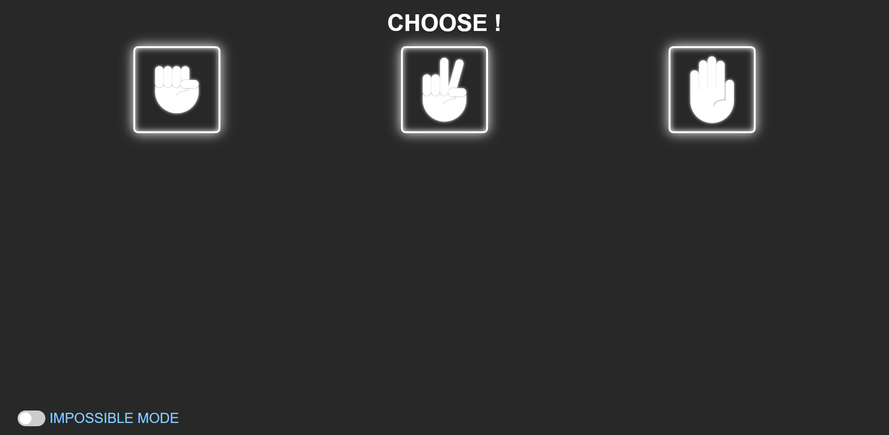
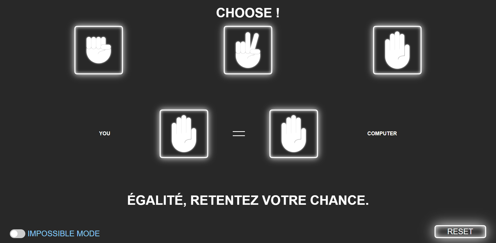
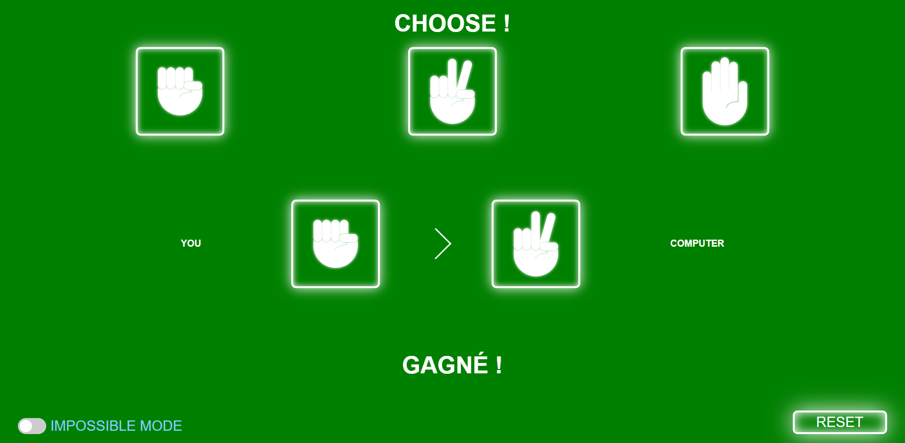
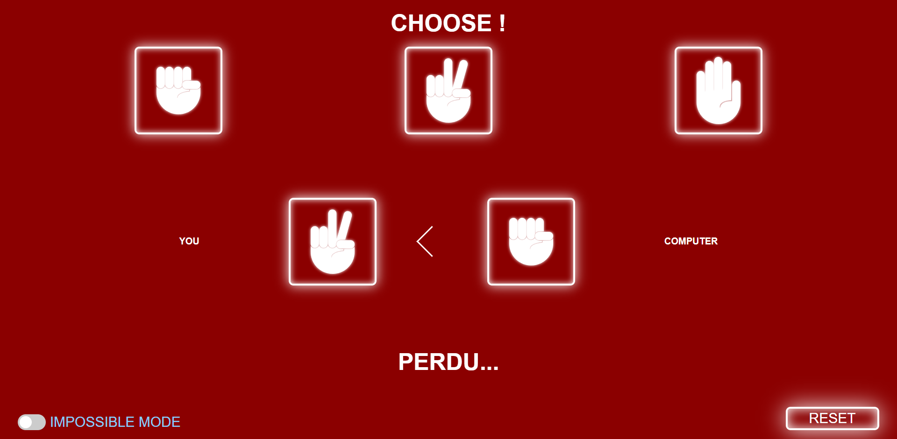

# Shifumi WEB

First project to better understand JS and DOM.
(I really don't like JS...)

## Fonctionnement

The website is quite simple: Arrived on the page, you can choose between rock, paper and scissor.

After making a choice, the computer will randomly choose between them three and you'll see the result!

At the end of the round, you can reset the game by clicking on the "RESET" button at the bottom left.

Finally, you can activate the impossible mode at the bottom left of the page... You'll never win! :smiling_imp:

## Images

<figure style="text-align: center">
  <figcaption>Home page</figcaption>
  
</figure>

<figure style="text-align: center">
  <figcaption>No one have won, but no one have lost !</figcaption>
  
</figure>

<figure style="text-align: center">
  <figcaption>User have won !</figcaption>
  
</figure>

<figure style="text-align: center">
  <figcaption>User have lost !</figcaption>
  
</figure>
